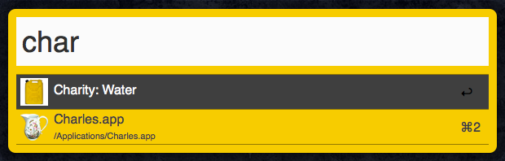

# Alfred

Provides [Alfred](http://www.alfredapp.com) themes and workflows for [OSX](http://www.apple.com/osx).

<!-- START doctoc generated TOC please keep comment here to allow auto update -->
<!-- DON'T EDIT THIS SECTION, INSTEAD RE-RUN doctoc TO UPDATE -->
# Table of Contents

- [Features](#features)
- [Requirements](#requirements)
- [Setup](#setup)
- [Usage](#usage)
    - [Themes](#themes)
    - [Workflows](#workflows)
- [Versioning](#versioning)
- [Code of Conduct](#code-of-conduct)
- [Contributions](#contributions)
- [License](#license)
- [History](#history)
- [Credits](#credits)

<!-- END doctoc generated TOC please keep comment here to allow auto update -->

# Features

- Provides the [Alchemists](https://www.alchemists.io) and [Charity: Water](http://www.charitywater.org)
  installable themes:

- Provides the following installable workflows:
  - Apple Say
  - Application Kit
  - Browser Kit
  - DNS Kit
  - Energy Kit
  - Google Chrome Kit
  - Memory Kit
  - Mountain King
  - WiFi Kit

# Requirements

1. [OSX](http://www.apple.com/osx)
2. [Alfred 2.x.x](http://www.alfredapp.com)
3. [Alfred Powerpack](http://www.alfredapp.com/purchase)

# Setup

Open a terminal window and execute one of the following depending on your version preference:

Current Version (stable):

    git clone git://github.com/bkuhlmann/alfred.git
    cd alfred
    git checkout v4.0.0

Master Version (unstable):

    git clone git://github.com/bkuhlmann/alfred.git
    cd alfred

# Usage

## Themes
0. Browse to the _themes_ folder.
0. Double-click a *.alfredappearance file to install.

## Workflows
0. Browse to the _workflows_ folder.
0. Double-click a *.alfredworkflow file to install.

# Versioning

Read [Semantic Versioning](http://semver.org) for details. Briefly, it means:

- Patch (x.y.Z) - Incremented for small, backwards compatible bug fixes.
- Minor (x.Y.z) - Incremented for new, backwards compatible public API enhancements and/or bug fixes.
- Major (X.y.z) - Incremented for any backwards incompatible public API changes.

# Code of Conduct

Please note that this project is released with a [CODE OF CONDUCT](CODE_OF_CONDUCT.md). By participating in this project
you agree to abide by its terms.

# Contributions

Read [CONTRIBUTING](CONTRIBUTING.md) for details.

# License

Copyright (c) 2011 [Alchemists](https://www.alchemists.io).
Read the [LICENSE](LICENSE.md) for details.

# History

Read the [CHANGELOG](CHANGELOG.md) for details.

# Credits

Developed by [Brooke Kuhlmann](https://www.alchemists.io) at [Alchemists](https://www.alchemists.io)
