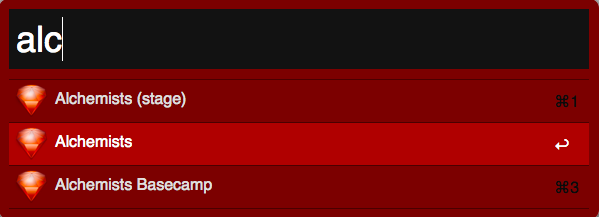

# Alfred

Provides [Alfred](http://www.alfredapp.com) themes and workflows for
[macOS](https://www.apple.com/macos).

<!-- Tocer[start]: Auto-generated, don't remove. -->

## Table of Contents

  - [Features](#features)
  - [Requirements](#requirements)
  - [Setup](#setup)
  - [Usage](#usage)
    - [Themes](#themes)
    - [Workflows](#workflows)
  - [Versioning](#versioning)
  - [Code of Conduct](#code-of-conduct)
  - [Contributions](#contributions)
  - [License](#license)
  - [History](#history)
  - [Credits](#credits)

<!-- Tocer[finish]: Auto-generated, don't remove. -->

## Features

- Provides the [Alchemists](https://www.alchemists.io) installable themes:

- Provides the following installable workflows:
  - **Application Kit**: Launches applications needed for everyday use.
  - **Browser Kit**: Easily open browsers and URLs.
  - **Google Chrome Kit**: Provides quick navigation for Google Chrome utilities.
  - **macOS Kit**: A collection of macOS-related tools and utilities.

## Requirements

1. [macOS](https://www.apple.com/macos)
2. [Alfred 2.x.x](http://www.alfredapp.com)
3. [Alfred Powerpack](https://www.alfredapp.com/powerpack/buy)

## Setup

Open a terminal window and execute one of the following depending on your version preference:

Current Version (stable):

    git clone https://github.com/bkuhlmann/alfred.git
    cd alfred
    git checkout v6.1.0

Master Version (unstable):

    git clone https://github.com/bkuhlmann/alfred.git
    cd alfred

## Usage

### Themes

0. Browse to the _themes_ folder.
0. Double-click a *.alfredappearance file to install.

### Workflows

0. Browse to the _workflows_ folder.
0. Double-click a *.alfredworkflow file to install.

## Versioning

Read [Semantic Versioning](http://semver.org) for details. Briefly, it means:

- Major (X.y.z) - Incremented for any backwards incompatible public API changes.
- Minor (x.Y.z) - Incremented for new, backwards compatible, public API enhancements/fixes.
- Patch (x.y.Z) - Incremented for small, backwards compatible, bug fixes.

## Code of Conduct

Please note that this project is released with a [CODE OF CONDUCT](CODE_OF_CONDUCT.md). By
participating in this project you agree to abide by its terms.

## Contributions

Read [CONTRIBUTING](CONTRIBUTING.md) for details.

## License

Copyright (c) 2011 [Alchemists](https://www.alchemists.io).
Read [LICENSE](LICENSE.md) for details.

## History

Read [CHANGES](CHANGES.md) for details.

## Credits

Developed by [Brooke Kuhlmann](https://www.alchemists.io) at
[Alchemists](https://www.alchemists.io).
