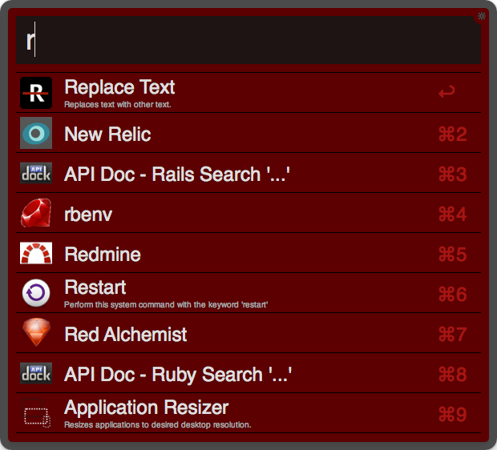

# Overview

Provides [Alfred](http://www.alfredapp.com) themes and workflows for [OSX](http://www.apple.com/osx).

# Features

* Provides the [Red Alchemist](http://www.redalchemist.com) and [Charity: Water](http://www.charitywater.org)
  installable themes:

* Provides the following installable workflows:
  * Apple Say
  * Application Kit
  * Browser Kit
  * DNS Kit
  * Energy Kit
  * Google Chrome Kit
  * Memory Kit
  * Mountain King
  * Rebrew Ruby
  * WiFi Kit

# Requirements

1. [OSX](http://www.apple.com/osx).
2. [Alfred 2.x.x](http://www.alfredapp.com).
3. [Alfred Powerpack](http://www.alfredapp.com/purchase).

# Setup

Open a terminal window and execute one of the following depending on your version preference:

Current Version (stable):

    git clone git://github.com/bkuhlmann/alfred.git
    cd alfred
    git checkout v3.0.0

Master Version (unstable):

    git clone git://github.com/bkuhlmann/alfred.git
    cd alfred

# Usage

## Theme Installation
0. Browse to the _themes_ folder.
0. Double-click a *.alfredappearance file to install.

## Workflow Installation
0. Browse to the _workflows_ folder.
0. Double-click a *.alfredworkflow file to install.

# Versioning

Read [Semantic Versioning](http://semver.org) for details. Briefly, it means:

* Patch (x.y.Z) - Incremented for small, backwards compatible bug fixes.
* Minor (x.Y.z) - Incremented for new, backwards compatible public API enhancements and/or bug fixes.
* Major (X.y.z) - Incremented for any backwards incompatible public API changes.

# Contributions

Read CONTRIBUTING for details.

# Credits

Developed by [Brooke Kuhlmann](http://www.redalchemist.com) at [Red Alchemist](http://www.redalchemist.com)

# License

Copyright (c) 2011 [Red Alchemist](http://www.redalchemist.com).
Read the LICENSE for details.

# History

Read the CHANGELOG for details.
